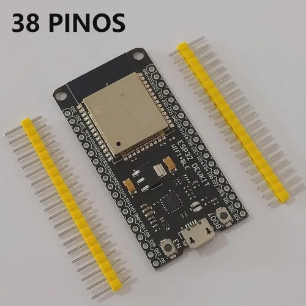
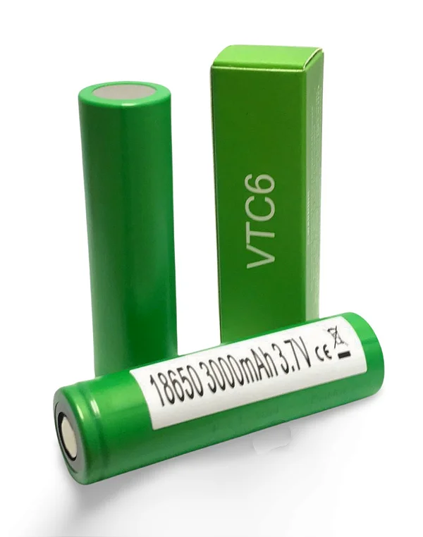
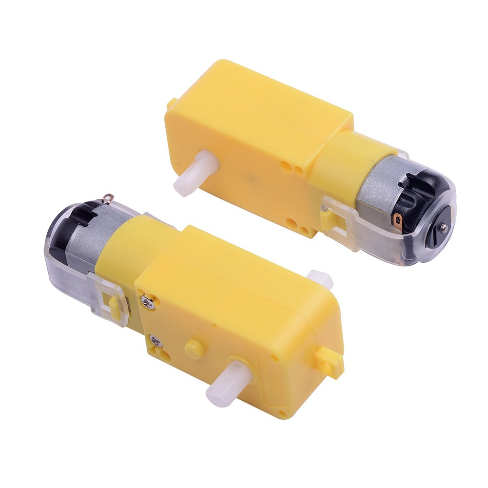
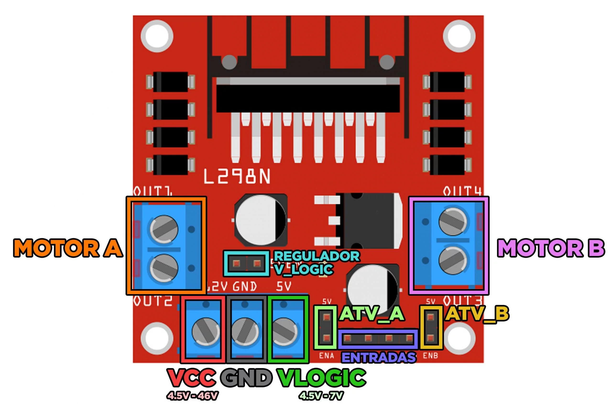

# Cilc-Project

### To understand better the idea you can check enounciate: 

<a href="./E6 - FINAL PROJECT.pdf" target=_blank>E6 - Final Project</a></h3>

 ## 1-The problem to solve:

the problem is tecnology that only arrives to industries:
Imagine a fast-paced highway where only big trucks can travel. These trucks, representing industries, 
zoom ahead with the latest technology, leaving smaller vehicles behind. This scenario depicts the problem: technology 
advancements that only reach the big players in industries, while smaller businesses and individuals are left stranded on 
the sidelines, unable to access these innovations 

## 2- drones that can be used by everyone like: firefighters, cops, transit departement, halping people moving home etc. 
	
Imagine a world where drones aren't just high-tech gadgets for a select few, but versatile tools accessible to everyone. 
Firefighters use them to navigate through dangerous terrain, cops deploy them for aerial surveillance, transportation departments 
rely on their efficiency, and individuals benefit from their aid in moving homes or delivering essentials. These drones become not just a 
symbol of technological advancement, but a practical solution that empowers and assists across various facets of life.

## 3 - this drones will help people trough public services helping them help people and making life easier.
	
These versatile drones, now accessible across public services, herald a new era of assistance and efficiency. They serve as indispensable 
aids, empowering firefighters to navigate through perilous situations, assisting law enforcement in ensuring public safety, aiding transportation 
departments in streamlining operations, and even helping individuals relocate with ease. Their integration into public services marks a transformative 
shift, where technology becomes a powerful ally, enhancing the capability of these services to help people and ultimately making daily life simpler and 
safer for everyone

## 4 - first of all we need to refine the ideia to a prototype. with this prototype we can adapt it to every vertent(firefighters, cops, moving furniture drone etc)

- 1st step was to set the ideia witch was mobility drones.
- 2nd step was to what industry have nowadays.
- 3rd step was how to recreate in a smaller scale.
- 4rth step was finding the parts that we needed.
- 5th step was to create the prototype to prove that it's possible to do spending not much money.

## 5 - what can it be used for?

The drones integration into various public services expands their utility manifold. They're employed for multifaceted tasks such as aiding firefighters in navigating hazardous environments, supporting law enforcement for surveillance and monitoring, assisting transportation departments in optimizing operations, and aiding individuals in tasks like moving homes or facilitating deliveries. Essentially, these drones serve as versatile tools across public sectors, enhancing their capacity to offer aid, streamline processes, and ultimately contribute to making everyday life safer, easier, and more efficient for people across different spheres of society.

## 6 - Where you can buy it or download it?

That's a big problem because it's hard every segment needs a price and an financing so it will depend on what product and if it's financed or not.And the distribution it will be made by the industries who financiate-it or local stores delievered by mail to those who buy it.

## 7 - The prototype:

### Parts needed:

- esp33:

    
1 esp32 to be the controller
    

    
    

- Batteries:

    
 4 Batteries
    

    
    

- Motors:

    
 2 Motors
    

    
    

- H bridge:

    
 1 H Bridge
    

    
    

### you can chose any toy or create by yourself to inject the hardware :wink:

 in my case i chose an excavator to have mor power and the result is like this:
 

## 8 - Video: 

video showing tests of the development
 
<video width="630" height="300" src="./images/VID-20231112-WA0056~2.mp4"></video>

## 8 - Slide:

